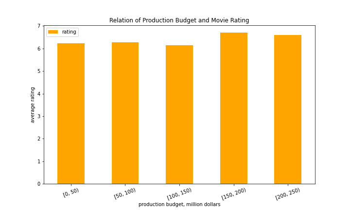

# Microsoft Movie Analysis

**Author:** Volha Puzikava

## Overview

This project analyzes the movie datasets from famous movie websites in order to find out what types of films have been doing the best at the box offices since 2010. The results of the exploratory data analyses can help the stakeholders in building a new movie studio, as they generate the insights of the top genres and directors with the highest average worldwide gross, as well as cover the relation between the movie ratings and production budget.

## Business Problem

Microsoft have decided to create a new movie studio, but they don’t know anything about creating movies. My task was to analyze three movie datasets from [IMDB](https://www.imdb.com), [TheMovieDB](https://www.themoviedb.org) and [The Numbers](https://www.the-numbers.com) and yeild three business recommendations for the company.

***
Questions that were answered in the project:
* What are the highest worldwide grossing movie genres since 2010?
* What are the highest worldwide grossing movie directors since 2010?
* Is there a relation between average movie ratings and the production budget? If yes, recommend the production budget with the highest rating.
***

## Data

The data for the analysis was collected from various locations. Some data files were compressed CSV, while the data from IMDB was located in a SQLite database. The data provided various information about movies: their own specific id, genre, release date, original title, production budget, language, directors, writers, etc. The metric information was represented by rating and worldwide gross. The movie aspects that were analyzed in terms of metrics included genres, directors and production budget.
***
Since different dataframes contained different release years (some went back to 1916), I decided to perform analysis on movies that were released starting 2010. As a result, the movie analyses were peformed on the eight-year period: from 2010 to 2018. 
***
Only one out of the three DataFrames contained duplicates and null values. Duplicates were dropped and null values were changed to 'Unknown'. The date columns in the provided DataFrames were of a different format, so they were transformed only to show the year of release. The type of those columns was also changed from object to integer. Since almost all the movies belonged to different genres rather than just to one, the data was exploded in order to transform each element in the column 'genre' to a separate row. The columns of the DataFrames, that contained the same information, were renamed so the DataFrames could be merged on the same column names.

## Methods

Descriptive analysis were used to analyze and model the data. Horizontal bar charts were plotted in order to find the most wolrdwide grossing movie genres and movie directors since 2010. 
***
To determine the relation between the production budget and movie rating, the following steps were performed:
* the production budget was binned, however, the outlier (the movie with the highest production budget) was not included
* the data was grouped, the average rating was found for each binned category
* bar chart was plotted
***
All the information was taken from the merged DataFrame. 

## Results

 
The highest worldwide grossing movie genres since 2010 have been animation, adventure and science fiction.

The highest worldwide grossing movie directors since 2010 are [Joss Whedon](https://www.imdb.com/name/nm0923736/#director), [Kyle Balda](https://www.imdb.com/name/nm0049633/), and [Pierre Coffin](https://www.imdb.com/name/nm1853544/).

As seen from the bar plot, the production budget doesn't influcence much on the average movie rating, since the ratings are between 6 and 7 stars for all budgets. However, the best ratings belong to the movies with the production budget from 150 million dollars to 200 million dollars.

## Conclusions

This analysis leads to three recommendations for building a new movie studio by Microsoft:

***
* The movie genres with the highest average worldwide gross are Animation, Adventure and Science Fiction.
* The movie directors with the highest average worldwide gross are Joss Whedon, Kyle Balda, and Pierre Coffin.
* There is no direct relation between movie production budget and its rating, since average rating fluctuates between 6 and 7 stars. However, the best ratings belongs to movie with the production budget from 150 million dollars to 200 million dollars.
***
The results of the performed analysis can be used by Microsoft in order to get the higher profit when filming. However, a deeper research can be conducted. So, the analysis of movie ratings and the months when the movies were released, the wolrdwide gross of the movies and the writers of those movies, etc. can be done in order to get a bigger image of the movies that do the best at the box offices. Also, as concerns the relation between production budget and average movie ratings, more research could be conducted and the number of films in each category should be taken into account. If we look at the number of movies for each binned category, we will see that the majority of movies have budget below 50 million dollars and their ratings fluctuate from the lowest to the highest. So, to my opinion, movies in those category along should be analyzed to get the more accurate image of the situation.
